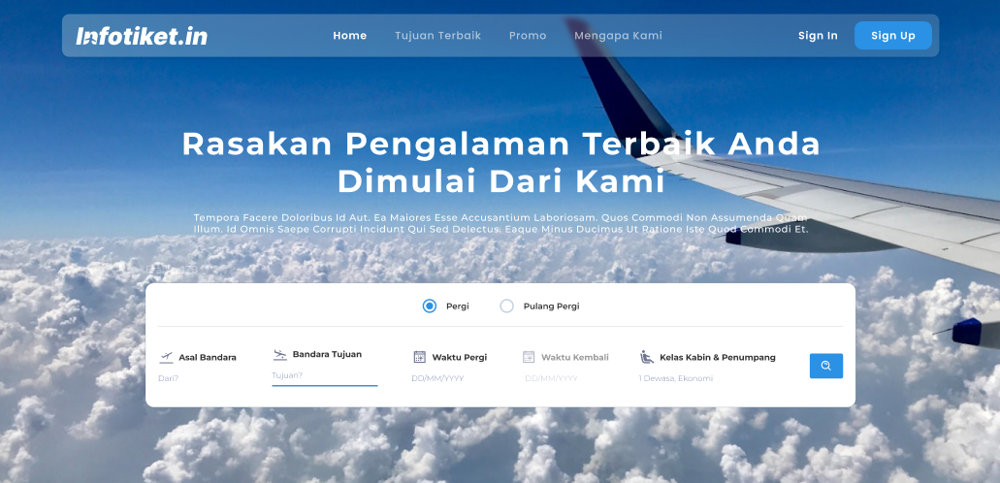

<!-- <br />
<br />
<br />
<p align="center">
    <a href="hhttps://github.com/mmrizzdn/BE_KM-6_Infotiket.in-b3-Final-Project">
    
</p>

<h1 align="center">Team BE-3 Infotiketin </h1>

<p align="center">
   <a href="https://infotiket.in" target="_blank" rel="noopener">View Demo</a>
</p>

## Daftar isi

- [Daftar isi](#daftar-isi)
- [Tentang Proyek](#tentang-proyek)
- [Dibangun Dengan](#dibangun-dengan)
- [Syarat-syarat](#syarat-syarat)
  - [Prasyarat](#prasyarat)
  - [Instalasi](#instalasi)
  - [Jalankan Secara Lokal](#jalankan-secara-lokal)
- [Fitur](#fitur)
  - [Admin](#admin)
  - [Pengguna \& Admin](#pengguna--admin)
  - [_Repository Github Frontend_ : _Front End_](#repository-github-frontend--front-end)
  - [_Repository Github Backend_ : _Back End_](#repository-github-backend--back-end)
- [Catatan](#catatan)
- [Penulis Backend](#penulis-backend)
- [Penulis Frontend](#penulis-frontend)
- [Alat-alat Koloborasi](#alat-alat-koloborasi)

## Tentang Proyek



<p align="center">Team BE-3 Infotiketin</p>

Infotiketin adalah final proyek dari Binar Academy KM6, website infotekitin menyajikan layanan yang memungkinkan Anda membeli tiket pesawat untuk seluruh Indonesia. Layanan ini menawarkan berbagai maskapai dengan harga yang kompetitif. Dengan Infotiketin, pelanggan dapat dengan mudah mencari, membandingkan, dan memesan tiket pesawat sesuai kebutuhan mereka. Selain itu, Infotiketin menawarkan informasi terkini tentang jadwal penerbangan dan penawaran khusus, serta berbagai metode pembayaran yang aman dan nyaman, dan layanan pelanggan yang tersedia 24 jam sehari.

## Dibangun Dengan

Teknologi yang digunakan dalam proyek ini:

- [Nodejs](https://nodejs.org/en)
- [Express](https://expressjs.com/)
- [PostgreSQL](https://yarnpkg.com/)
- [Prisma](https://www.prisma.io/)
- [Passport](https://www.postgresql.org/)
- [NPM](https://www.npmjs.com/)
- [Yarn](https://yarnpkg.com/)

## Syarat-syarat

### Prasyarat

- Anda perlu menginstal versi v18.17.1 [Node.js](https://nodejs.org/en).

### Instalasi

1. Clone the repo:

   ```sh
   git clone https://github.com/mmrizzdn/BE_KM-6_Infotiket.in-b3-Final-Project.git
   ```

2. Install all yarn or NPM

   ```sh
   yarn install
   ```

   Atau

   ```sh
   npm run install
   ```

3. Tambahkan kredensial ke _environment_

4. Migrasikan database dengan menjalankan perintah ini:

   ```sh
   npm run migrate
   ```

   ```sh
   npm run seed
   ```

   Atau

   ```sh
   yarn migrate
   ```

   ```sh
   yarn seed
   ```

### Jalankan Secara Lokal

Anda dapat menjalankan proyek ini secara lokal untuk mencobanya.

1. Jalankan _local development server_:

   ```sh
   npm run dev
   ```

   Or

   ```sh
   yarn dev
   ```

2. Open `http://localhost:3000`.

## Fitur

### Admin

1. Pengguna

   | Method         | Function       | Route          | Route Detail   |
   | -------------- | -------------- | -------------- | -------------- |
   | On development | On development | On development | On development |

### Pengguna & Admin

1. Dokumentasi Lengkap API di Swagger

   | Method | Function | Route     | Route Detail                          |
   | ------ | -------- | --------- | ------------------------------------- |
   | GET    | -        | /api-docs | http://localhost:3000/api/v1/api-docs |

2. Authentication

   | Method | Function       | Route                      | Route Detail                                                       |
   | ------ | -------------- | -------------------------- | ------------------------------------------------------------------ |
   | POST   | register       | /daftar-sekarang           | http://localhost:3000/api/v1/auth/daftar-sekarang                  |
   | POST   | login          | /masuk                     | http://localhost:3000/api/v1/auth/masuk                            |
   | GET    | firstPage      | /halaman-utama             | http://localhost:3000/api/v1/auth/halaman-utama                    |
   | GET    | firstPage      | /halaman-utama             | http://localhost:3000/api/v1/auth/halaman-utama?=token=            |
   | GET    | verifyEmail    | /verifikasi                | http://localhost:3000/api/v1/auth/verifikasi                       |
   | POST   | forgotPassword | /lupa-kata-sandi           | http://localhost:3000/api/v1/auth/lupa-kata-sandi                  |
   | POST   | resetPassword  | /mengatur-ulang-kata-sandi | http://localhost:3000/api/v1/auth/mengatur-ulang-kata-sandi?token= |
   | GET    | googleOauth2   | /google                    | http://localhost:3000/api/v1/auth/google                           |

3. Bandara

   | Method | Function | Route       | Route Detail                              |
   | ------ | -------- | ----------- | ----------------------------------------- |
   | GET    | airports | /bandara    | http://localhost:3000/api/v1/auth/bandara |
   | GET    | airport  | /bandara:id | http://localhost:3000/api/v1/bandara/{id} |

4. Maskapai penerbangan

   | Method | Function | Route       | Route Detail                               |
   | ------ | -------- | ----------- | ------------------------------------------ |
   | GET    | airlines | /airlines   | http://localhost:3000/api/v1/auth/airlines |
   | GET    | airline  | /airline:id | http://localhost:3000/api/v1/airline/{id}  |

5. Pesawat terbang

   | Method | Function  | Route        | Route Detail                                |
   | ------ | --------- | ------------ | ------------------------------------------- |
   | GET    | airplanes | /airplanes   | http://localhost:3000/api/v1/auth/airplanes |
   | GET    | airplane  | /airplane:id | http://localhost:3000/api/v1/airplane/{id}  |

6. Penerbangan

   | Method | Function | Route    | Route Detail                              |
   | ------ | -------- | -------- | ----------------------------------------- |
   | GET    | flights  | /flights | http://localhost:3000/api/v1/auth/flights |

7. Profil

   | Method | Function   | Route   | Route Detail                             |
   | ------ | ---------- | ------- | ---------------------------------------- |
   | GET    | profileGet | /profil | http://localhost:3000/api/v1/auth/profil |
   | PUT    | profilePut | /profil | http://localhost:3000/api/v1/auth/profil |

8. Penumpang

   | Method | Function     | Route       | Route Detail                                 |
   | ------ | ------------ | ----------- | -------------------------------------------- |
   | POST   | addPassenger | /passengers | http://localhost:3000/api/v1/auth/passengers |

9. Transaksi

   | Method         | Function       | Route          | Route Detail   |
   | -------------- | -------------- | -------------- | -------------- |
   | On development | On development | On development | On development |

10. Pemesanan

    | Method         | Function       | Route          | Route Detail   |
    | -------------- | -------------- | -------------- | -------------- |
    | On development | On development | On development | On development |

### _Repository Github Frontend_ : _[Front End](https://github.com/RegisSRifaldi/)_

### _Repository Github Backend_ : _[Back End](https://github.com/mmrizzdn/BE_KM-6_Infotiket.in-b3-Final-Project/)_

## Catatan

## Penulis Backend

- [Regis Syawaludin Rifaldi](https://github.com/RegisSRifaldi/)
- [M. Ammar Izzudin](https://github.com/mmrizzdn/)
- [Rengga Dwi Pribadi](https://github.com/Karepto/)

## Penulis Frontend

- [Nikodemus Hendrojoyo Suryokuncoro](https://github.com/)
- [William Rayhan Harsono](https://github.com/)
- [Deo Seprty Wengi](https://github.com/)

## Alat-alat Koloborasi

- [Stand Up Harian Tim B3 Binar KM6](https://docs.google.com/spreadsheets/d/1GUb8tJedR4y00KAKUNpKsjDaM0C3rOnuyjOEHsynucA/edit?gid=594962013#gid=594962013)
- [Trello Tim B3 Binar KM6](https://trello.com/b/1MU48LGZ/fp-binar-b3)
- [Deployment Frontend](https://trello.com/b/1MU48LGZ/fp-binar-b3)
- [Deployment Backend](https://expressjs-develop-b4d1.up.railway.app/api/v1/api-docs/) -->
